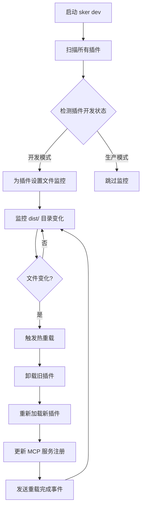

# TODO-V3.md - 开发体验改善：热重载系统

## 📋 项目概述

基于当前 Sker MCP 项目状态，实现插件热重载系统以提升开发体验。该系统将自动监控插件构建产物变化，实时热重载插件代码，让开发者能够即时看到代码修改效果。

## 🎯 核心需求分析

### 用户场景
```bash
# 开发者工作流程
1. 开发者在 ~/.sker/plugins/my-plugin/ 下开发插件
2. 运行 sker dev 启动开发模式
3. 修改插件 TypeScript 源码
4. TypeScript 自动编译到 dist/ 目录
5. Sker 监控到构建产物变化
6. 自动热重载插件，无需重启服务器
7. AI 客户端立即可以使用新版本插件功能
```

### 技术要求
- 🔥 **热重载**: 插件代码变更时自动重载，无需重启服务器
- 📁 **文件监控**: 监控插件构建产物(dist/)变化
- 🔍 **开发状态检测**: 自动识别插件是否处于开发模式
- ⚡ **增量更新**: 只重载变更的插件，不影响其他插件
- 🛡️ **错误隔离**: 插件重载失败时不影响服务器运行
- 📊 **状态反馈**: 提供清晰的重载状态和错误信息

## 🏗️ 系统架构设计

### 极简组件架构
```
src/dev/
├── hot-reload-manager.ts      # 热重载管理器 (核心组件)
└── file-watcher.ts            # 文件监控器 (简化版)

# 复用现有组件
src/core/plugin-manager.ts     # 扩展现有插件管理器
```

### 热重载工作流


## 📋 详细实施计划

### Phase 1: 极简文件监控 (Week 1)

#### 1.1 文件监控器 (Priority: CRITICAL)
```typescript
// src/dev/file-watcher.ts
@Injectable()
class FileWatcher {
  constructor(@Inject(LOGGER) private logger: IWinstonLogger) {}

  watchPlugin(pluginPath: string): Promise<void>;
  stopWatching(pluginPath: string): Promise<void>;
  isWatching(pluginPath: string): boolean;
}
```

**具体任务**:
- [ ] 检查 package.json sker.development 标志位
- [ ] 监控 package.json main 文件变更
- [ ] 文件变更时触发重载事件

### Phase 2: 极简热重载管理器 (Week 1)

#### 2.1 热重载管理器 (Priority: CRITICAL)
```typescript
// src/dev/hot-reload-manager.ts
@Injectable()
class HotReloadManager {
  constructor(
    @Inject(LOGGER) private logger: IWinstonLogger,
    @Inject(PluginManager) private pluginManager: PluginManager
  ) {}

  startDevMode(): Promise<void>;
  stopDevMode(): Promise<void>;
  reloadPlugin(pluginName: string): Promise<boolean>;
}
```

**具体任务**:
- [ ] 扫描所有插件，监控设置了 sker.development=true 的插件
- [ ] 文件变更时调用 PluginManager.reloadPlugin()
- [ ] 简单的防抖处理（500ms）

### Phase 3: CLI 集成 (Week 1)

#### 3.1 简化 CLI 命令 (Priority: HIGH)
```bash
sker dev                        # 启动开发模式，自动监控所有 sker.development=true 的插件
sker dev status                 # 显示监控状态
sker dev reload <plugin>        # 手动重载指定插件
```

**具体任务**:
- [ ] 实现 sker dev 命令 - 启动 HotReloadManager
- [ ] 实现状态显示 - 显示正在监控的插件列表  
- [ ] 实现手动重载 - 强制重载指定插件

## 🎯 实现总结

整个热重载系统被极大简化为：

1. **FileWatcher** - 监控设置了 `sker.development=true` 的插件主文件
2. **HotReloadManager** - 协调文件监控和插件重载
3. **简化 CLI** - 基本的开发命令
4. **复用现有架构** - 使用现有的 PluginManager、日志系统等

## 🔧 技术实现细节

### Package.json 开发模式标志位配置

插件的 `package.json` 需要包含 `sker.development` 标志位来明确指定开发模式：

```json
{
  "name": "my-sker-plugin",
  "version": "1.0.0", 
  "main": "dist/index.js",
  "scripts": {
    "dev": "tsc --watch",
    "build": "tsc"
  },
  "sker": {
    "development": true  // 明确标记为开发模式
  }
}
```

**标志位规则**：
- `"sker.development": true` - 启用开发模式，监控主文件变更
- 其他情况（false 或未设置）- 禁用开发模式，不进行监控

### 核心依赖
```json
{
  "dependencies": {
    "chokidar": "^3.5.3"           // 文件监控
  }
}
```

### 开发模式检测算法
```typescript
// 简化的开发模式检测 - 仅使用 package.json 标志位
function isInDevelopmentMode(pluginPath: string): boolean {
  const pkg = require(path.join(pluginPath, 'package.json'));
  
  // 只检查 sker.development 标志位
  return pkg.sker?.development === true;
}
```

## 💡 核心设计理念

**极简主义**：只实现核心热重载功能，避免过度工程化
**明确性**：通过 package.json 标志位明确控制开发模式  
**实用性**：专注于提升开发体验，而不是复杂的系统特性

## 🔗 相关文档

- [核心架构设计](./docs/core-architecture.md)
- [插件系统架构](./docs/plugin-system.md)
- [Feature Injector 设计](./docs/plugin-feature-injector-design.md)
- [配置管理系统](./docs/config-management.md)
- [HTTP 传输协议](./docs/http-transport.md)

---
*本文档将根据开发进展持续更新，确保热重载系统与项目架构保持一致。*