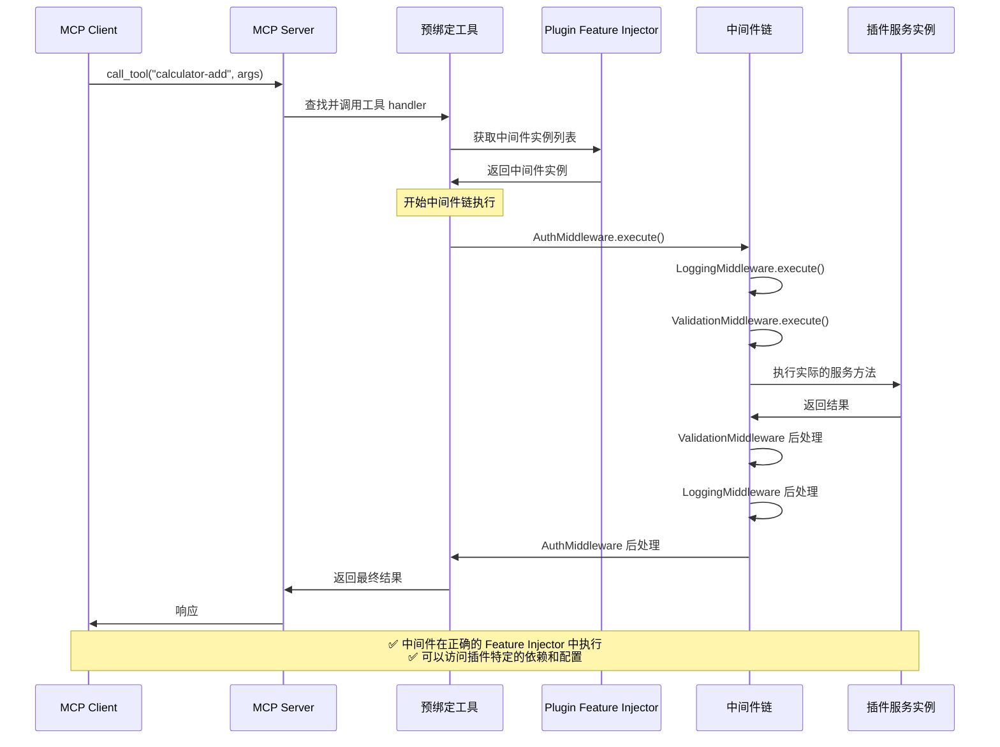
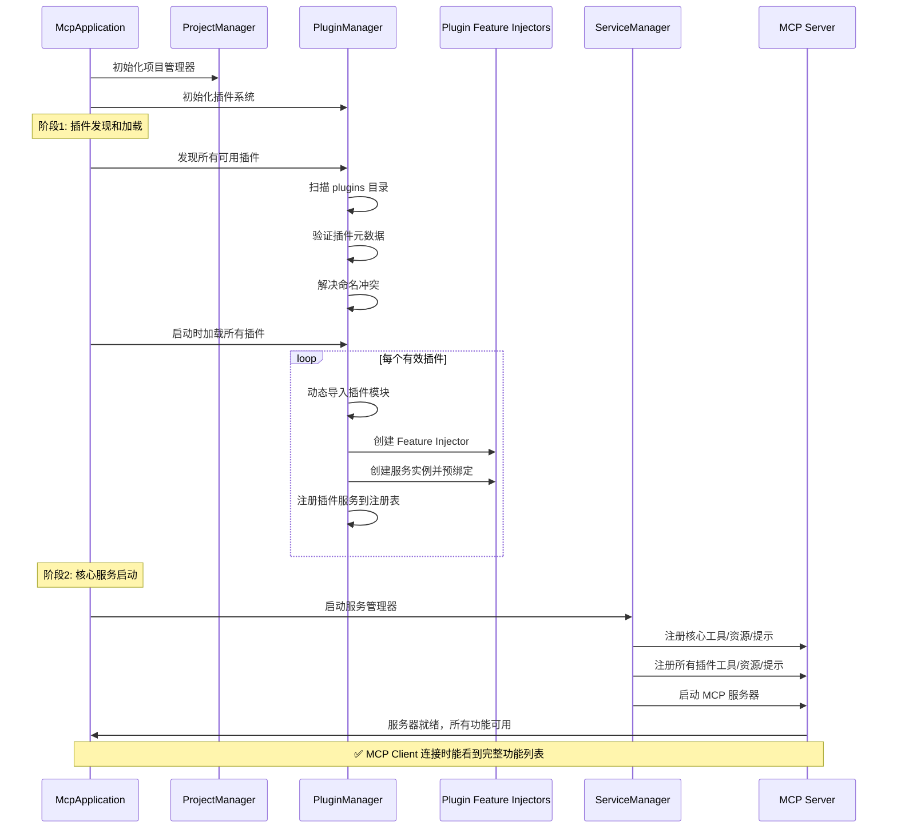
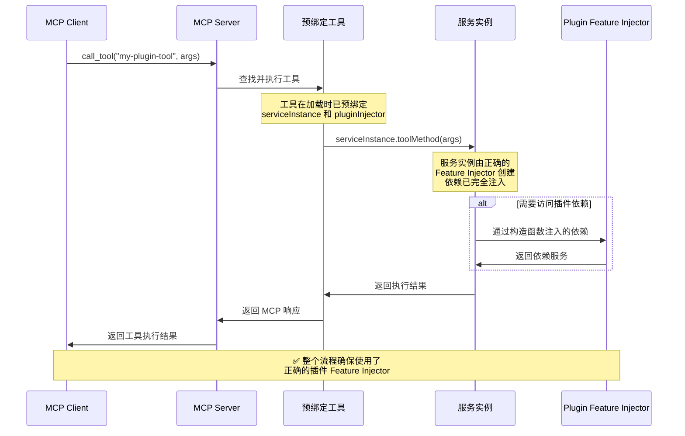
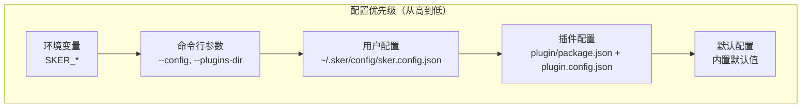

# 🏗️ 核心架构

## 系统概述

Sker Daemon MCP 服务器采用现代化的分层架构设计，基于装饰器驱动的开发模式，通过依赖注入系统实现高度模块化和可扩展性。

## 整体架构图

```mermaid
graph TB
    subgraph "应用层 (Application Layer)"
        CLI[CLI Interface<br/>命令行接口]
        MAIN[Main Entry<br/>主入口]
        APP[McpApplication<br/>应用程序主类]
    end

    subgraph "核心层 (Core Layer)"
        SM[ServiceManager<br/>服务管理器]
        META[MetadataCollector<br/>元数据收集器]
        PM[ProjectManager<br/>项目管理器]
        PLUGIN[PluginManager<br/>插件管理器]
        TYPES[Types & Interfaces<br/>类型定义]
        TOKENS[Injection Tokens<br/>注入令牌]
        PROVIDERS[Providers<br/>依赖提供者]
    end

    subgraph "功能层 (Feature Layer)"
        BUILTIN[Built-in Services<br/>内置服务]
        PLUGINS[Plugin Services<br/>插件服务]
    end

    subgraph "装饰器层 (Decorator Layer)"
        TOOL_DEC[@Tool<br/>工具装饰器]
        RES_DEC[@Resource<br/>资源装饰器]
        PROMPT_DEC[@Prompt<br/>提示装饰器]
        MW_DEC[@UseMiddleware<br/>中间件装饰器]
        ERR_DEC[@ErrorHandler<br/>错误处理装饰器]
    end

    subgraph "MCP 协议层 (MCP Protocol Layer)"
        SERVER[MCP Server<br/>协议服务器]
        TOOLS[Tools<br/>工具集合]
        RESOURCES[Resources<br/>资源集合]
        PROMPTS[Prompts<br/>提示集合]
    end

    subgraph "传输层 (Transport Layer)"
        STDIO[Stdio Transport<br/>标准输入输出]
        HTTP[HTTP Transport<br/>HTTP 传输]
    end

    CLI --> APP
    MAIN --> APP
    APP --> SM
    APP --> PM
    APP --> PLUGIN
    SM --> META
    SM --> SERVER
    PM --> PLUGIN
    PLUGIN --> PLUGINS
    META --> BUILTIN
    META --> PLUGINS
    SERVER --> TOOLS
    SERVER --> RESOURCES
    SERVER --> PROMPTS
    SERVER --> STDIO
    SERVER --> HTTP
```

## 分层架构详解

### 应用层 (Application Layer)

**职责**: 应用程序入口和用户交互

#### 核心组件

- **main.ts**: 主入口文件，负责应用程序启动
- **cli.ts**: 命令行接口，提供服务器管理功能
- **McpApplication**: 应用程序主类，管理整个应用生命周期

#### McpApplication 架构

```typescript
export class McpApplication {
  private injector: Injector;
  private serviceManager: IServiceManager;
  private metadataCollector: IMetadataCollector;
  private projectManager: IProjectManager;
  private pluginManager: IPluginManager;
  
  constructor(config: IMcpServerConfig);
  
  // 核心生命周期方法
  async start(): Promise<void>;
  async stop(): Promise<void>;
  async restart(): Promise<void>;
  
  // 状态管理
  getStatus(): ApplicationStatus;
  isRunning(): boolean;
}
```

### 核心层 (Core Layer)

**职责**: 核心业务逻辑和架构支撑

#### ServiceManager (服务管理器)

```typescript
export class ServiceManager implements IServiceManager {
  constructor(
    @Inject(MCP_TOOLS) private tools: IMcpTool[],
    @Inject(MCP_RESOURCES) private resources: IMcpResource[],
    @Inject(MCP_PROMPTS) private prompts: IMcpPrompt[],
    private mcpServer: McpServer
  );
  
  async start(): Promise<void>;
  async stop(): Promise<void>;
  getStatus(): ServiceStatus;
}
```

**核心职责**:
- MCP 服务器启动和停止
- 通过依赖注入获取所有功能
- 将工具/资源/提示注册到 MCP 服务器
- 服务状态监控

#### MetadataCollector (元数据收集器)

```typescript
export class MetadataCollector implements IMetadataCollector {
  static collectProvidersFromServices(serviceClasses: any[]): Provider[];
  
  // 获取服务类的元数据
  static getToolsMetadata(ServiceClass: any): ToolMetadata[];
  static getResourcesMetadata(ServiceClass: any): ResourceMetadata[];
  static getPromptsMetadata(ServiceClass: any): PromptMetadata[];
  
  // 创建预绑定服务实例的功能对象
  static createBoundTool(metadata: ToolMetadata, serviceInstance: any, injector: Injector): IMcpTool;
  static createBoundResource(metadata: ResourceMetadata, serviceInstance: any, injector: Injector): IMcpResource;
  static createBoundPrompt(metadata: PromptMetadata, serviceInstance: any, injector: Injector): IMcpPrompt;
}
```

**核心职责**:
- 收集功能服务类的装饰器元数据
- 生成对应的 providers 配置
- **创建预绑定服务实例的功能对象**（核心特性）
- 支持插件动态加载时的服务实例绑定

#### ProjectManager (项目管理器)

```typescript
export class ProjectManager implements IProjectManager {
  constructor(config: IMcpServerConfig);
  
  getProjectRoot(): string;
  getPluginsDirectory(): string;
  getWorkingDirectory(): string;
  resolveRelativePath(relativePath: string): string;
  ensureDirectoryExists(path: string): Promise<void>;
}
```

**核心职责**:
- 项目路径和目录管理
- 插件目录维护
- 相对路径解析

### 装饰器层 (Decorator Layer)

**职责**: 元数据标记和功能声明

#### 核心装饰器

##### @Tool 装饰器

```typescript
export function Tool(options: ToolOptions = {}) {
  return function (target: any, propertyKey: string, descriptor: PropertyDescriptor) {
    // 收集参数类型信息
    const paramTypes = Reflect.getMetadata('design:paramtypes', target, propertyKey);
    const paramSchemas = Reflect.getMetadata('param:schemas', target, propertyKey);
    
    // 构建输入 schema
    const inputSchema = this.buildInputSchema(paramSchemas);
    
    // 存储元数据
    this.storeMetadata(target, {
      type: 'tool',
      name: options.name || propertyKey,
      title: options.title,
      description: options.description,
      inputSchema,
      handler: descriptor.value
    });
  };
}
```

##### @Input 装饰器

```typescript
export function Input(schema: ZodType<any>) {
  return function (target: any, propertyKey: string, parameterIndex: number) {
    const existingSchemas = Reflect.getMetadata('param:schemas', target, propertyKey) || [];
    existingSchemas[parameterIndex] = schema;
    Reflect.defineMetadata('param:schemas', existingSchemas, target, propertyKey);
  };
}
```

**@Input 装饰器优势**:
- **类型安全**: 编译时检查，IDE 智能提示
- **代码简洁**: 声明式参数定义
- **自动验证**: 运行时自动参数验证
- **类型一致**: TypeScript 类型与验证规则同步

##### @ErrorHandler 装饰器

```typescript
export function ErrorHandler(handler: new () => IErrorHandler) {
  return function (target: any, propertyKey: string, descriptor: PropertyDescriptor) {
    const originalMethod = descriptor.value;
    
    descriptor.value = async function (...args: any[]) {
      try {
        return await originalMethod.apply(this, args);
      } catch (error) {
        const errorHandler = new handler();
        const context: ErrorContext = {
          toolName: propertyKey,
          args,
          timestamp: new Date()
        };
        throw await errorHandler.handleError(error as Error, context);
      }
    };
  };
}
```

##### @UseMiddleware 装饰器

```typescript
export function UseMiddleware(...middlewares: (new () => IMiddleware)[]) {
  return function (target: any, propertyKey: string, descriptor: PropertyDescriptor) {
    const originalMethod = descriptor.value;
    
    descriptor.value = async function (...args: any[]) {
      const context: MiddlewareContext = {
        toolName: propertyKey,
        args,
        metadata: target.constructor._mcpMetadata?.find((m: any) => m.name === propertyKey),
        requestId: crypto.randomUUID(),
        startTime: new Date()
      };
      
      let index = 0;
      
      const next: NextFunction = async () => {
        if (index < middlewares.length) {
          const middleware = new middlewares[index++]();
          return await middleware.execute(context, next);
        } else {
          return await originalMethod.apply(this, args);
        }
      };
      
      return await next();
    };
  };
}
```

#### 使用示例

```typescript
import { Tool, Input, UseMiddleware, ErrorHandler, ValidationMiddleware, LoggingMiddleware, ValidationErrorHandler } from '@sker/mcp';
import { z } from 'zod';

export class CalculatorService {
  @Tool({
    name: 'calculate',
    description: '执行数学运算'
  })
  @UseMiddleware(LoggingMiddleware, ValidationMiddleware)
  @ErrorHandler(ValidationErrorHandler)
  async calculate(
    @Input(z.number()) a: number,
    @Input(z.number()) b: number,
    @Input(z.enum(['add', 'subtract'])) operation: string
  ) {
    const result = operation === 'add' ? a + b : a - b;
    return { content: [{ type: 'text', text: `Result: ${result}` }] };
  }
}
```

**执行流程**: 
1. 请求进入 → LoggingMiddleware（记录日志）
2. → ValidationMiddleware（验证参数）  
3. → calculate 方法执行
4. 如发生错误 → ValidationErrorHandler 处理
5. 响应返回 ← LoggingMiddleware（记录响应）

### MCP 协议层 (MCP Protocol Layer)

**职责**: MCP 协议实现和功能注册

#### 核心接口

```typescript
export interface IMcpTool {
  name: string;
  title?: string;
  description?: string;
  inputSchema?: ZodRawShape;
  outputSchema?: ZodRawShape;
  annotations?: ToolAnnotations;
  handler: ToolCallback;
  enabled?: boolean;
  
  // 服务实例预绑定扩展
  pluginInjector?: Injector;        // 插件的 Feature Injector 引用
  serviceInstance?: any;            // 预绑定的服务实例
  pluginMetadata?: ToolMetadata;    // 原始元数据
}

export interface IMcpResource {
  name: string;
  uri: string;
  metadata: ResourceMetadata;
  handler: ReadResourceCallback;
  enabled?: boolean;
  
  // 服务实例预绑定扩展
  pluginInjector?: Injector;
  serviceInstance?: any;
  pluginMetadata?: ResourceMetadata;
}

export interface IMcpPrompt {
  name: string;
  metadata: PromptMetadata;
  argsSchema?: any;
  handler: PromptCallback;
  enabled?: boolean;
  
  // 服务实例预绑定扩展
  pluginInjector?: Injector;
  serviceInstance?: any;
  pluginMetadata?: PromptMetadata;
}
```

### 传输层 (Transport Layer)

**职责**: 客户端通信和协议传输

- **Stdio Transport**: 标准输入输出传输，适用于命令行集成
- **HTTP Transport**: HTTP 协议传输，适用于 Web 服务集成

## 错误处理与插件系统集成

### Feature Injector 中的错误处理

错误处理组件在 Feature Injector 架构中的集成方式：

```mermaid
graph TD
    subgraph "Application Injector"
        GlobalErrorHandler[全局错误处理器<br/>DefaultErrorHandler]
        ErrorLogger[错误日志服务<br/>ErrorLogger]
    end
    
    subgraph "Plugin A Feature Injector"
        PluginErrorHandler[插件错误处理器<br/>CustomErrorHandler]
        PluginService[插件服务<br/>@ErrorHandler(CustomErrorHandler)]
        
        PluginService --> PluginErrorHandler
        PluginErrorHandler --> GlobalErrorHandler
        PluginErrorHandler --> ErrorLogger
    end
    
    subgraph "Plugin B Feature Injector"
        ValidationHandler[验证错误处理器<br/>ValidationErrorHandler]
        ValidatedService[验证服务<br/>@ErrorHandler(ValidationErrorHandler)]
        
        ValidatedService --> ValidationHandler
        ValidationHandler --> GlobalErrorHandler
        ValidationHandler --> ErrorLogger
    end
```

### 错误处理器的 Injector 级别隔离

```typescript
// 插件级别错误处理配置
class PluginManager {
  private async createPluginErrorHandlers(
    pluginInjector: Injector, 
    plugin: IPlugin
  ): Promise<void> {
    // 1. 插件可以定义自己的错误处理器
    const pluginErrorHandlers = plugin.errorHandlers || [];
    
    // 2. 注册插件特定的错误处理器到 Plugin Feature Injector
    for (const ErrorHandlerClass of pluginErrorHandlers) {
      pluginInjector.bind(ErrorHandlerClass).toSelf();
    }
    
    // 3. 插件可以访问全局错误服务
    const globalErrorLogger = this.applicationInjector.get(ERROR_LOGGER);
    pluginInjector.bind(ERROR_LOGGER).toValue(globalErrorLogger);
  }
  
  private createBoundTool(metadata: any, serviceInstance: any, injector: Injector): IMcpTool {
    return {
      name: metadata.name,
      // ... 其他属性
      
      // 工具执行时的错误处理链
      handler: async (args: any) => {
        try {
          return await metadata.handler.call(serviceInstance, args);
        } catch (error) {
          // 1. 首先尝试插件级别的错误处理
          if (metadata.errorHandler) {
            const pluginErrorHandler = injector.get(metadata.errorHandler);
            return await pluginErrorHandler.handleError(error, {
              toolName: metadata.name,
              args,
              timestamp: new Date(),
              pluginName: injector.get('PLUGIN_NAME')
            });
          }
          
          // 2. 回退到全局错误处理
          const globalHandler = this.applicationInjector.get(DEFAULT_ERROR_HANDLER);
          throw await globalHandler.handleError(error, {
            toolName: metadata.name,
            args,
            timestamp: new Date()
          });
        }
      },
      
      pluginInjector: injector,
      serviceInstance: serviceInstance
    };
  }
}
```

### 错误处理的生命周期集成

```typescript
interface IPlugin {
  // ... 现有接口
  
  // 新增：错误处理器配置
  errorHandlers?: Array<new () => IErrorHandler>;
  
  // 新增：插件级错误处理钩子
  onError?(error: Error, context: ErrorContext): Promise<void>;
}

// 插件定义示例
const calculatorPlugin: IPlugin = {
  name: 'calculator-plugin',
  version: '1.0.0',
  services: [CalculatorService],
  
  // 插件特定的错误处理器
  errorHandlers: [CalculatorErrorHandler, MathValidationErrorHandler],
  
  // 插件级错误处理钩子
  async onError(error: Error, context: ErrorContext) {
    console.log(`Calculator plugin error in ${context.toolName}:`, error.message);
    // 可以发送到插件特定的错误收集服务
  }
};
```

## 中间件系统在架构中的集成

### Feature Injector 中的中间件

中间件系统在 Feature Injector 架构中的集成位置：

```mermaid
graph TD
    subgraph "Application Injector"
        GlobalMiddleware[全局中间件<br/>LoggingMiddleware, ValidationMiddleware]
        MiddlewareFactory[中间件工厂<br/>MiddlewareFactory]
    end
    
    subgraph "Plugin A Feature Injector"
        PluginMiddleware[插件中间件<br/>CacheMiddleware, AuthMiddleware]
        PluginService[插件服务<br/>@UseMiddleware(...)]
        
        PluginService --> PluginMiddleware
        PluginService --> GlobalMiddleware
    end
    
    subgraph "Plugin B Feature Injector"
        CustomMiddleware[自定义中间件<br/>RateLimitMiddleware]
        EnhancedService[增强服务<br/>@UseMiddleware(...)]
        
        EnhancedService --> CustomMiddleware
        EnhancedService --> GlobalMiddleware
    end
```

### 中间件的 Injector 级别配置

```typescript
class PluginManager {
  private async createPluginMiddlewares(
    pluginInjector: Injector,
    plugin: IPlugin
  ): Promise<void> {
    // 1. 注册插件特定的中间件到 Plugin Feature Injector
    const pluginMiddlewares = plugin.middlewares || [];
    for (const MiddlewareClass of pluginMiddlewares) {
      pluginInjector.bind(MiddlewareClass).toSelf();
    }
    
    // 2. 插件可以访问全局中间件
    const globalMiddlewares = this.applicationInjector.getAll(GLOBAL_MIDDLEWARES);
    for (const middleware of globalMiddlewares) {
      pluginInjector.bind(middleware.constructor).toValue(middleware);
    }
  }
  
  private createBoundTool(metadata: any, serviceInstance: any, injector: Injector): IMcpTool {
    return {
      name: metadata.name,
      // ... 其他属性
      
      // 工具执行时的中间件链
      handler: async (args: any) => {
        if (metadata.middlewares && metadata.middlewares.length > 0) {
          const context: MiddlewareContext = {
            toolName: metadata.name,
            args,
            metadata,
            requestId: crypto.randomUUID(),
            startTime: new Date(),
            pluginName: injector.get('PLUGIN_NAME')
          };
          
          let index = 0;
          
          const next: NextFunction = async () => {
            if (index < metadata.middlewares.length) {
              const MiddlewareClass = metadata.middlewares[index++];
              const middleware = injector.get(MiddlewareClass);
              return await middleware.execute(context, next);
            } else {
              return await metadata.handler.call(serviceInstance, args);
            }
          };
          
          return await next();
        } else {
          return await metadata.handler.call(serviceInstance, args);
        }
      },
      
      pluginInjector: injector,
      serviceInstance: serviceInstance
    };
  }
}
```

### 中间件的生命周期集成

```typescript
interface IPlugin {
  // ... 现有接口
  
  // 新增：插件特定中间件
  middlewares?: Array<new () => IMiddleware>;
  
  // 新增：中间件配置
  middlewareConfig?: {
    global?: string[];        // 要使用的全局中间件名称
    order?: string[];         // 中间件执行顺序
    disabled?: string[];      // 禁用的中间件
  };
}

// 插件定义示例
const calculatorPlugin: IPlugin = {
  name: 'calculator-plugin',
  version: '1.0.0',
  services: [CalculatorService],
  
  // 插件特定的中间件
  middlewares: [CacheMiddleware, CalculatorAuthMiddleware],
  
  // 中间件配置
  middlewareConfig: {
    global: ['LoggingMiddleware', 'ValidationMiddleware'],
    order: ['CalculatorAuthMiddleware', 'LoggingMiddleware', 'ValidationMiddleware', 'CacheMiddleware'],
    disabled: ['RateLimitMiddleware']
  },
  
  async onLoad() {
    console.log('Calculator plugin loaded with custom middleware stack');
  }
};
```

### 中间件执行流程（在 Feature Injector 环境中）



## 依赖注入系统

### 注入令牌定义

```typescript
// 核心令牌
export const MCP_SERVER_CONFIG = new InjectionToken<IMcpServerConfig>('MCP_SERVER_CONFIG');
export const MCP_TOOLS = new InjectionToken<IMcpTool>('MCP_TOOLS');
export const MCP_RESOURCES = new InjectionToken<IMcpResource>('MCP_RESOURCES');
export const MCP_PROMPTS = new InjectionToken<IMcpPrompt>('MCP_PROMPTS');

// 管理器令牌
export const SERVICE_MANAGER = new InjectionToken<IServiceManager>('SERVICE_MANAGER');
export const PROJECT_MANAGER = new InjectionToken<IProjectManager>('PROJECT_MANAGER');
export const PLUGIN_MANAGER = new InjectionToken<IPluginManager>('PLUGIN_MANAGER');
export const METADATA_COLLECTOR = new InjectionToken<IMetadataCollector>('METADATA_COLLECTOR');
```

### Multi 特性支持

利用 `@sker/di` 的 `multi: true` 特性实现功能聚合：

```typescript
export function createMcpProviders(config: IMcpServerConfig): Provider[] {
  return [
    // 基础配置
    { provide: MCP_SERVER_CONFIG, useValue: config },
    { provide: McpServer, useFactory: createMcpServer, deps: [MCP_SERVER_CONFIG] },
    
    // 多实例令牌 - 自动聚合同类型功能
    { provide: MCP_TOOLS, useValue: [], multi: true },
    { provide: MCP_RESOURCES, useValue: [], multi: true },
    { provide: MCP_PROMPTS, useValue: [], multi: true },
    
    // 核心服务
    { provide: SERVICE_MANAGER, useClass: ServiceManager },
    { provide: PROJECT_MANAGER, useClass: ProjectManager },
    { provide: PLUGIN_MANAGER, useClass: PluginManager },
    { provide: METADATA_COLLECTOR, useClass: MetadataCollector }
  ];
}
```

## 启动流程

### 完整启动序列（启动时加载所有插件）



### 启动日志示例

```
🚀 启动 Sker Daemon MCP 服务器...
📂 项目根目录: /path/to/project
🔌 初始化插件系统...
📂 插件目录: /path/to/plugins

🔍 发现插件...
📦 发现 2 个插件:
  ✅ calculator-plugin@1.0.0 - 高级计算器插件
  ✅ text-plugin@2.1.0 - 文本处理插件

📦 启动时加载所有插件...
📦 加载插件: calculator-plugin@1.0.0
  🏗️ 创建 Feature Injector
  ⚙️ 创建服务实例: CalculatorService
  🔗 预绑定 3 个工具
  ✅ 插件加载完成

📦 加载插件: text-plugin@2.1.0  
  🏗️ 创建 Feature Injector
  ⚙️ 创建服务实例: TextService
  🔗 预绑定 2 个工具，1 个资源
  ✅ 插件加载完成

🚀 启动服务管理器...
✅ 注册了 3 个核心工具
✅ 注册了 5 个插件工具
✅ 注册了 1 个核心资源
✅ 注册了 1 个插件资源
✅ 注册了 2 个提示

🔥 热重载已启用 (开发环境)
✅ Sker Daemon MCP 服务器启动成功！
💡 MCP Client 连接时将看到完整的 9 个工具和 2 个资源
```

### 工具执行流程

插件加载完成后，工具的执行流程如下：



## 配置系统详细设计

### 配置层次结构

配置系统采用多层次配置继承机制，优先级从高到低：



### 核心配置接口

```typescript
export interface IMcpServerConfig {
  name: string;
  version: string;
  description?: string;
  
  // 插件系统配置
  plugins?: {
    enabled: boolean;
    directory: string;
    autoLoad: boolean;
    allowConflicts: boolean;
    conflictStrategy: 'warn' | 'error' | 'override';
    
    // 新增：插件扫描配置
    scanDepth?: number;           // 扫描目录深度，默认 3
    scanPatterns?: string[];      // 插件文件匹配模式
    excludePatterns?: string[];   // 排除模式
    
    // 新增：插件加载配置
    loadTimeout?: number;         // 插件加载超时（毫秒）
    parallelLoad?: boolean;       // 是否并行加载插件
    maxConcurrentLoads?: number;  // 最大并发加载数
  };
  
  // 路径配置
  projectRoot?: string;
  workingDirectory?: string;
  scanDirectories?: string[];
  
  // 服务器配置
  autoStart?: boolean;
  transport?: 'stdio' | 'http';
  httpConfig?: {
    port: number;
    host?: string;
    cors?: boolean;
  };
  
  // 新增：日志配置
  logging?: {
    level: 'debug' | 'info' | 'warn' | 'error';
    format: 'json' | 'text';
    output: 'console' | 'file' | 'both';
    logFile?: string;
    maxFiles?: number;
    maxSize?: string;
  };
  
  // 新增：性能配置
  performance?: {
    enableMetrics: boolean;
    metricsInterval: number;      // 指标收集间隔（秒）
    memoryThreshold: number;      // 内存警告阈值（MB）
    cpuThreshold: number;         // CPU 警告阈值（%）
  };
  
  // 新增：安全配置
  security?: {
    enableSandbox: boolean;       // 插件沙箱
    allowedModules: string[];     // 允许的 Node.js 模块
    maxExecutionTime: number;     // 工具最大执行时间（毫秒）
    resourceLimits?: {
      maxMemory: number;          // 最大内存使用（MB）
      maxFileSize: number;        // 最大文件大小（MB）
    };
  };
}
```

### 配置文件位置和格式

#### 1. 主配置文件

```json
// ~/.sker/config/sker.config.json
{
  "name": "sker-daemon",
  "version": "1.0.0",
  "description": "Sker Daemon MCP Server",
  
  "plugins": {
    "enabled": true,
    "directory": "./plugins",
    "autoLoad": true,
    "allowConflicts": true,
    "conflictStrategy": "warn",
    "scanDepth": 3,
    "loadTimeout": 30000,
    "parallelLoad": true,
    "maxConcurrentLoads": 5
  },
  
  "logging": {
    "level": "info",
    "format": "text",
    "output": "both",
    "logFile": "logs/sker.log",
    "maxFiles": 7,
    "maxSize": "10MB"
  },
  
  "performance": {
    "enableMetrics": true,
    "metricsInterval": 60,
    "memoryThreshold": 512,
    "cpuThreshold": 80
  },
  
  "security": {
    "enableSandbox": false,
    "allowedModules": ["fs", "path", "crypto"],
    "maxExecutionTime": 30000,
    "resourceLimits": {
      "maxMemory": 256,
      "maxFileSize": 10
    }
  }
}
```

#### 2. 插件特定配置

```json
// ~/.sker/plugins/calculator-plugin/plugin.config.json
{
  "pluginName": "calculator-plugin",
  "enabled": true,
  "priority": 100,
  
  "config": {
    "precision": 10,
    "maxOperands": 100,
    "enableCache": true,
    "cacheSize": 1000
  },
  
  "dependencies": {
    "required": ["@sker/core"],
    "optional": ["redis"]
  },
  
  "permissions": {
    "fileSystem": ["read"],
    "network": false,
    "childProcess": false
  },
  
  "middleware": {
    "enabled": ["LoggingMiddleware", "ValidationMiddleware"],
    "disabled": ["RateLimitMiddleware"],
    "custom": {
      "CacheMiddleware": {
        "ttl": 3600,
        "maxSize": 1000
      }
    }
  }
}
```

### 环境变量配置

```bash
# 核心配置
export SKER_HOME_DIR="/custom/path/to/sker"
export SKER_PLUGINS_DIR="/custom/plugins/path"
export SKER_LOG_LEVEL="debug"
export SKER_TRANSPORT="stdio"

# 插件配置
export SKER_PLUGINS_ENABLED="true"
export SKER_PLUGINS_AUTO_LOAD="true" 
export SKER_PLUGINS_PARALLEL_LOAD="true"
export SKER_PLUGINS_MAX_CONCURRENT="3"

# 性能配置
export SKER_ENABLE_METRICS="true"
export SKER_MEMORY_THRESHOLD="512"
export SKER_CPU_THRESHOLD="80"

# 安全配置
export SKER_ENABLE_SANDBOX="false"
export SKER_MAX_EXECUTION_TIME="30000"
```

### 配置加载和合并实现

```typescript
export class ConfigManager {
  private config: IMcpServerConfig;
  
  constructor() {
    this.config = this.loadConfiguration();
  }
  
  private loadConfiguration(): IMcpServerConfig {
    // 1. 加载默认配置
    let config = this.getDefaultConfig();
    
    // 2. 合并用户配置文件
    config = this.mergeUserConfig(config);
    
    // 3. 合并命令行参数
    config = this.mergeCommandLineArgs(config);
    
    // 4. 合并环境变量
    config = this.mergeEnvironmentVariables(config);
    
    // 5. 验证最终配置
    this.validateConfig(config);
    
    return config;
  }
  
  private getDefaultConfig(): IMcpServerConfig {
    return {
      name: 'sker-daemon',
      version: '1.0.0',
      description: 'Sker Daemon MCP Server',
      
      plugins: {
        enabled: true,
        directory: './plugins',
        autoLoad: true,
        allowConflicts: true,
        conflictStrategy: 'warn',
        scanDepth: 3,
        loadTimeout: 30000,
        parallelLoad: true,
        maxConcurrentLoads: 5
      },
      
      projectRoot: process.env.SKER_HOME_DIR || path.join(os.homedir(), '.sker'),
      transport: 'stdio',
      
      logging: {
        level: 'info',
        format: 'text',
        output: 'console'
      },
      
      performance: {
        enableMetrics: false,
        metricsInterval: 60,
        memoryThreshold: 512,
        cpuThreshold: 80
      },
      
      security: {
        enableSandbox: false,
        allowedModules: ['fs', 'path', 'crypto', 'zod'],
        maxExecutionTime: 30000,
        resourceLimits: {
          maxMemory: 256,
          maxFileSize: 10
        }
      }
    };
  }
  
  private mergeUserConfig(config: IMcpServerConfig): IMcpServerConfig {
    const userConfigPath = path.join(config.projectRoot!, 'config', 'sker.config.json');
    
    if (fs.existsSync(userConfigPath)) {
      try {
        const userConfig = JSON.parse(fs.readFileSync(userConfigPath, 'utf8'));
        config = deepMerge(config, userConfig);
        console.log(`✅ 已加载用户配置: ${userConfigPath}`);
      } catch (error) {
        console.warn(`⚠️ 用户配置加载失败: ${error.message}`);
      }
    }
    
    return config;
  }
  
  private mergeEnvironmentVariables(config: IMcpServerConfig): IMcpServerConfig {
    const envMappings = {
      'SKER_HOME_DIR': 'projectRoot',
      'SKER_PLUGINS_DIR': 'plugins.directory',
      'SKER_LOG_LEVEL': 'logging.level',
      'SKER_TRANSPORT': 'transport',
      'SKER_PLUGINS_ENABLED': 'plugins.enabled',
      'SKER_PLUGINS_AUTO_LOAD': 'plugins.autoLoad',
      'SKER_ENABLE_METRICS': 'performance.enableMetrics',
      'SKER_MEMORY_THRESHOLD': 'performance.memoryThreshold',
      'SKER_MAX_EXECUTION_TIME': 'security.maxExecutionTime'
    };
    
    for (const [envVar, configPath] of Object.entries(envMappings)) {
      const envValue = process.env[envVar];
      if (envValue !== undefined) {
        this.setNestedProperty(config, configPath, this.parseEnvValue(envValue));
        console.log(`✅ 应用环境变量 ${envVar}=${envValue}`);
      }
    }
    
    return config;
  }
  
  private setNestedProperty(obj: any, path: string, value: any): void {
    const keys = path.split('.');
    let current = obj;
    
    for (let i = 0; i < keys.length - 1; i++) {
      if (!(keys[i] in current)) {
        current[keys[i]] = {};
      }
      current = current[keys[i]];
    }
    
    current[keys[keys.length - 1]] = value;
  }
  
  private parseEnvValue(value: string): any {
    // 尝试解析为布尔值
    if (value.toLowerCase() === 'true') return true;
    if (value.toLowerCase() === 'false') return false;
    
    // 尝试解析为数字
    const numValue = Number(value);
    if (!isNaN(numValue)) return numValue;
    
    // 返回字符串
    return value;
  }
  
  // 插件特定配置加载
  async loadPluginConfig(pluginName: string, pluginPath: string): Promise<any> {
    const configPath = path.join(pluginPath, 'plugin.config.json');
    
    if (fs.existsSync(configPath)) {
      try {
        const pluginConfig = JSON.parse(fs.readFileSync(configPath, 'utf8'));
        console.log(`✅ 已加载插件配置: ${pluginName}`);
        return pluginConfig;
      } catch (error) {
        console.warn(`⚠️ 插件配置加载失败 ${pluginName}: ${error.message}`);
        return {};
      }
    }
    
    return {};
  }
  
  getConfig(): IMcpServerConfig {
    return this.config;
  }
  
  updateConfig(updates: Partial<IMcpServerConfig>): void {
    this.config = deepMerge(this.config, updates);
    this.validateConfig(this.config);
  }
  
  private validateConfig(config: IMcpServerConfig): void {
    // 基本验证
    if (!config.name) throw new Error('配置错误: name 是必需的');
    if (!config.version) throw new Error('配置错误: version 是必需的');
    
    // 路径验证
    if (config.projectRoot && !fs.existsSync(config.projectRoot)) {
      fs.mkdirSync(config.projectRoot, { recursive: true });
    }
    
    // 插件配置验证
    if (config.plugins?.enabled) {
      if (!config.plugins.directory) {
        throw new Error('配置错误: plugins.directory 是必需的');
      }
      
      if (config.plugins.maxConcurrentLoads && config.plugins.maxConcurrentLoads < 1) {
        throw new Error('配置错误: plugins.maxConcurrentLoads 必须大于 0');
      }
    }
    
    console.log('✅ 配置验证通过');
  }
}

// 深度合并工具函数
function deepMerge(target: any, source: any): any {
  const result = { ...target };
  
  for (const key in source) {
    if (source[key] !== null && typeof source[key] === 'object' && !Array.isArray(source[key])) {
      result[key] = deepMerge(result[key] || {}, source[key]);
    } else {
      result[key] = source[key];
    }
  }
  
  return result;
}
```

## 项目目录配置

### 默认目录设置

项目默认在用户主目录的 `.sker` 文件夹下运行：
- **默认路径**: `~/.sker` (Windows: `%USERPROFILE%\.sker`)
- **环境变量**: `SKER_HOME_DIR` 可用于覆盖默认路径
- **插件目录**: `{SKER_HOME_DIR}/plugins`
- **配置文件**: `{SKER_HOME_DIR}/config`

### 环境变量配置

```bash
# 设置自定义项目目录
export SKER_HOME_DIR="/custom/path/to/sker"

# Windows 下设置
set SKER_HOME_DIR=C:\custom\path\to\sker
```

## 目录结构

```
src/
├── core/                     # 核心架构
│   ├── types.ts             # 类型定义
│   ├── tokens.ts            # 依赖注入令牌
│   ├── decorators.ts        # 装饰器定义
│   ├── metadata-collector.ts # 元数据收集器
│   ├── service-manager.ts   # 服务管理器
│   ├── mcp-application.ts   # 应用程序主类
│   ├── providers.ts         # 依赖注入提供者
│   ├── project-manager.ts   # 项目管理器
│   └── plugins/            # 插件系统
│       ├── plugin-discovery.ts
│       ├── plugin-loader.ts
│       ├── conflict-detector.ts
│       └── plugin-manager.ts
├── features/                # 内置功能实现
├── plugins/                 # 插件目录
├── config/                 # 配置文件
├── cli.ts                 # 命令行接口
└── main.ts                # 主入口文件
```

## 核心优势

### 1. 服务实例预绑定
- **性能最优**: 工具执行时无需运行时查找，直接调用预绑定的服务实例
- **架构一致**: 确保工具执行时使用正确的插件 Feature Injector
- **类型安全**: 完整的 TypeScript 类型检查和编译时验证
- **调试友好**: 每个工具都明确绑定到特定的服务实例和插件

### 2. Feature Injector 隔离
- 每个插件拥有独立的 Feature Injector，实现完全隔离
- 支持插件的动态加载、卸载和重载
- 插件间依赖不冲突，可以安全地独立管理
- 插件可以访问 Application Injector 的共享服务

### 3. Multi 特性支持
- 利用 `@sker/di` 的 `multi: true` 特性
- 实现功能的自动聚合和批量处理
- 支持插件动态扩展

### 4. 装饰器驱动
- 通过装饰器提供声明式开发体验
- 减少样板代码，提高开发效率
- 支持元数据自动收集

### 5. 类型安全
- 完整的 TypeScript 类型检查
- 编译时错误发现
- IDE 智能提示支持

### 6. 模块化设计
- 支持功能模块的独立开发和组合
- 清晰的职责分离
- 易于测试和维护

## 相关文档

- [🔌 插件系统](./plugin-system.md) - 插件系统架构详解
- [🛡️ 错误处理](./error-handling.md) - 错误处理机制
- [🚀 中间件系统](./middleware-system.md) - 中间件架构