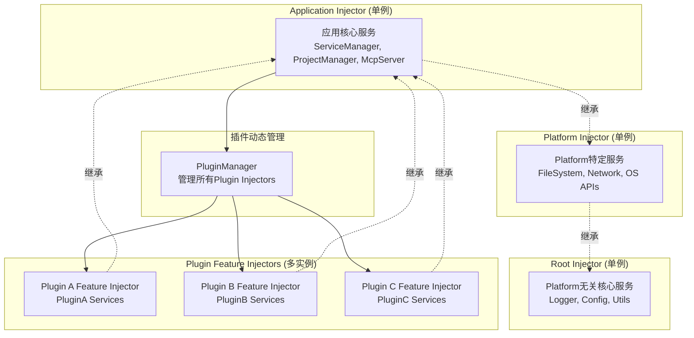
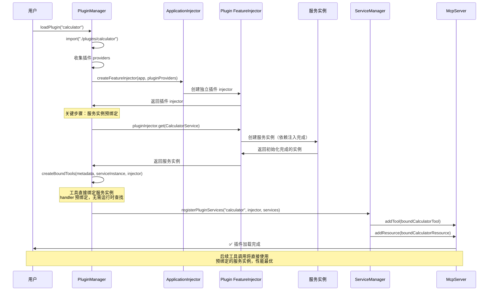
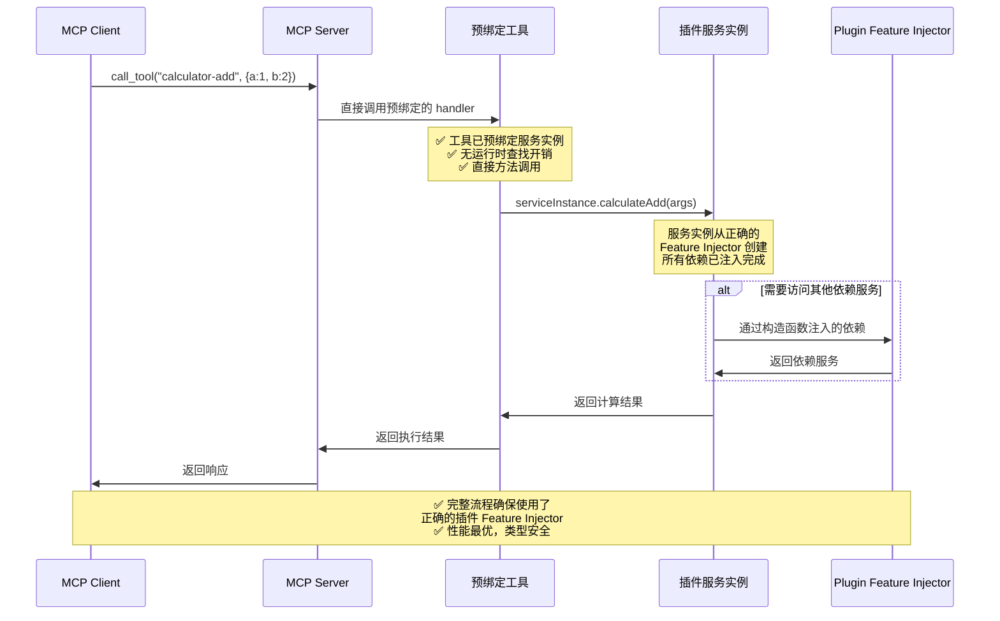
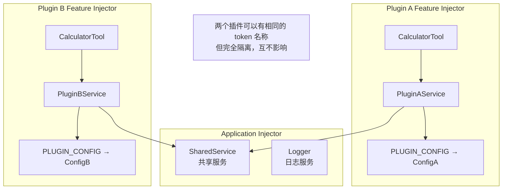

# 基于 Feature Injector 的插件隔离架构

## 核心设计思路

每个插件使用独立的 `createFeatureInjector`，实现插件级别的 provider 隔离，从而支持插件的动态加载/卸载/重载。

## Injector 层次结构重新设计



## 插件隔离机制

### 1. 插件独立性

```typescript
// 每个插件拥有独立的 Feature Injector
class PluginManager {
  private pluginInjectors = new Map<string, Injector>();
  private applicationInjector: Injector;
  
  constructor(appInjector: Injector) {
    this.applicationInjector = appInjector;
  }
  
  async loadPlugin(pluginName: string): Promise<void> {
    // 1. 导入插件模块
    const pluginModule = await import(`./plugins/${pluginName}`);
    const plugin = pluginModule.default;
    
    // 2. 收集插件的 providers
    const pluginProviders = MetadataCollector.collectProvidersFromServices(
      plugin.services
    );
    
    // 3. 为插件创建独立的 Feature Injector
    const pluginInjector = createFeatureInjector(
      this.applicationInjector,
      pluginProviders
    );
    
    // 4. 存储插件 injector
    this.pluginInjectors.set(pluginName, pluginInjector);
    
    // 5. 从插件 injector 获取服务并注册
    await this.registerPluginServices(pluginName, pluginInjector);
  }
  
  async unloadPlugin(pluginName: string): Promise<void> {
    const pluginInjector = this.pluginInjectors.get(pluginName);
    if (pluginInjector) {
      // 1. 注销插件服务
      await this.unregisterPluginServices(pluginName);
      
      // 2. 销毁插件 injector
      pluginInjector.dispose();
      
      // 3. 从管理器中移除
      this.pluginInjectors.delete(pluginName);
    }
  }
  
  async reloadPlugin(pluginName: string): Promise<void> {
    await this.unloadPlugin(pluginName);
    await this.loadPlugin(pluginName);
  }
}
```

### 2. 服务实例预绑定机制

```typescript
class ServiceManager {
  private pluginServices = new Map<string, PluginServiceRegistry>();
  
  // 应用启动时只注册核心服务
  constructor(
    @Inject(MCP_CORE_TOOLS) private coreTools: IMcpTool[],
    @Inject(MCP_CORE_RESOURCES) private coreResources: IMcpResource[],
    private mcpServer: McpServer
  ) {
    // 只注册核心服务
    coreTools.forEach(tool => mcpServer.addTool(tool));
    coreResources.forEach(resource => mcpServer.addResource(resource));
  }
  
  // 动态注册插件服务（服务实例预绑定）
  async registerPluginServices(
    pluginName: string, 
    pluginInjector: Injector,
    serviceClasses: any[]
  ): Promise<void> {
    const registry = new PluginServiceRegistry(pluginName);
    
    for (const ServiceClass of serviceClasses) {
      // 关键：从插件的 Feature Injector 创建服务实例
      const serviceInstance = pluginInjector.get(ServiceClass);
      
      // 创建绑定服务实例的工具/资源/提示
      const boundTools = this.createBoundTools(ServiceClass, serviceInstance, pluginInjector);
      const boundResources = this.createBoundResources(ServiceClass, serviceInstance, pluginInjector);
      const boundPrompts = this.createBoundPrompts(ServiceClass, serviceInstance, pluginInjector);
      
      // 注册到 MCP Server
      for (const tool of boundTools) {
        await this.mcpServer.addTool(tool);
        registry.addTool(tool);
      }
      
      for (const resource of boundResources) {
        await this.mcpServer.addResource(resource);
        registry.addResource(resource);
      }
      
      for (const prompt of boundPrompts) {
        await this.mcpServer.addPrompt(prompt);
        registry.addPrompt(prompt);
      }
    }
    
    this.pluginServices.set(pluginName, registry);
  }
  
  // 创建预绑定服务实例的工具
  private createBoundTools(ServiceClass: any, serviceInstance: any, injector: Injector): IMcpTool[] {
    const toolsMetadata = MetadataCollector.getToolsMetadata(ServiceClass);
    
    return toolsMetadata.map(metadata => ({
      name: metadata.name,
      title: metadata.title,
      description: metadata.description,
      inputSchema: metadata.inputSchema,
      
      // 核心：直接绑定服务实例，无需运行时查找
      handler: async (args: any) => {
        return await metadata.handler.call(serviceInstance, args);
      },
      
      // 保存引用便于调试和管理
      pluginInjector: injector,
      serviceInstance: serviceInstance,
      pluginMetadata: metadata
    }));
  }
  
  // 动态注销插件服务
  async unregisterPluginServices(pluginName: string): Promise<void> {
    const registry = this.pluginServices.get(pluginName);
    if (registry) {
      // 从 MCP Server 中移除
      for (const tool of registry.getTools()) {
        await this.mcpServer.removeTool(tool.name);
      }
      
      for (const resource of registry.getResources()) {
        await this.mcpServer.removeResource(resource.name);
      }
      
      for (const prompt of registry.getPrompts()) {
        await this.mcpServer.removePrompt(prompt.name);
      }
      
      // 清理服务实例引用
      registry.cleanup();
      this.pluginServices.delete(pluginName);
    }
  }
}
```

## 服务实例预绑定的动态加载时序



## 工具执行流程（核心优势）



## 插件隔离优势

### 1. 完全隔离的依赖

```typescript
// Plugin A 的服务
@Injectable()
class PluginAService {
  constructor(
    @Inject('PLUGIN_CONFIG') private config: PluginAConfig,
    @Inject('SHARED_SERVICE') private shared: SharedService // 来自 App Injector
  ) {}
}

// Plugin B 的服务  
@Injectable()
class PluginBService {
  constructor(
    @Inject('PLUGIN_CONFIG') private config: PluginBConfig, // 与 Plugin A 完全隔离
    @Inject('SHARED_SERVICE') private shared: SharedService // 共享 App 服务
  ) {}
}
```

### 2. 插件间冲突隔离



### 3. 安全的卸载机制

```typescript
class PluginServiceRegistry {
  private tools = new Set<IMcpTool>();
  private resources = new Set<IMcpResource>();
  private prompts = new Set<IMcpPrompt>();
  private subscriptions = new Set<Subscription>();
  
  addTool(tool: IMcpTool): void {
    this.tools.add(tool);
  }
  
  // 插件卸载时清理所有关联资源
  async cleanup(): Promise<void> {
    // 1. 取消所有订阅
    for (const subscription of this.subscriptions) {
      subscription.unsubscribe();
    }
    
    // 2. 清理工具资源
    for (const tool of this.tools) {
      await tool.cleanup?.();
    }
    
    // 3. 清理其他资源
    this.tools.clear();
    this.resources.clear();
    this.prompts.clear();
    this.subscriptions.clear();
  }
}
```

## 插件生命周期管理

### 完整生命周期

```typescript
interface IPluginLifecycle {
  // Feature Injector 创建后
  onInjectorCreated?(injector: Injector): Promise<void>;
  
  // 服务注册到 MCP Server 前
  onBeforeRegister?(): Promise<void>;
  
  // 服务注册到 MCP Server 后
  onAfterRegister?(): Promise<void>;
  
  // 插件卸载前
  onBeforeUnload?(): Promise<void>;
  
  // Feature Injector 销毁前
  onInjectorDispose?(): Promise<void>;
}

class PluginManager {
  async loadPlugin(pluginName: string): Promise<void> {
    const plugin = await this.importPlugin(pluginName);
    
    // 1. 创建 Feature Injector
    const injector = createFeatureInjector(this.appInjector, plugin.providers);
    await plugin.onInjectorCreated?.(injector);
    
    // 2. 注册服务前回调
    await plugin.onBeforeRegister?.();
    
    // 3. 注册服务
    await this.registerPluginServices(pluginName, injector);
    
    // 4. 注册服务后回调
    await plugin.onAfterRegister?.();
  }
  
  async unloadPlugin(pluginName: string): Promise<void> {
    const plugin = this.getPlugin(pluginName);
    const injector = this.pluginInjectors.get(pluginName);
    
    // 1. 卸载前回调
    await plugin.onBeforeUnload?.();
    
    // 2. 注销服务
    await this.unregisterPluginServices(pluginName);
    
    // 3. 销毁前回调
    await plugin.onInjectorDispose?.(injector);
    
    // 4. 销毁 Feature Injector
    injector.dispose();
    this.pluginInjectors.delete(pluginName);
  }
}
```

## 性能和内存管理

### 1. 延迟加载

```typescript
class LazyPluginManager extends PluginManager {
  private pluginMetadata = new Map<string, PluginMetadata>();
  
  // 启动时只加载元数据，不创建 injector
  async initialize(): Promise<void> {
    const pluginPaths = await this.discoverPlugins();
    
    for (const path of pluginPaths) {
      const metadata = await this.loadPluginMetadata(path);
      this.pluginMetadata.set(metadata.name, metadata);
    }
  }
  
  // 首次使用时才创建 Feature Injector
  async getPlugin(pluginName: string): Promise<Injector> {
    if (!this.pluginInjectors.has(pluginName)) {
      await this.loadPlugin(pluginName);
    }
    return this.pluginInjectors.get(pluginName)!;
  }
}
```

### 2. 内存泄漏防护

```typescript
class PluginInjectorWrapper {
  private injector: Injector;
  private createdAt: Date;
  private lastUsed: Date;
  
  constructor(injector: Injector) {
    this.injector = injector;
    this.createdAt = new Date();
    this.lastUsed = new Date();
  }
  
  use<T>(token: any): T {
    this.lastUsed = new Date();
    return this.injector.get(token);
  }
  
  dispose(): void {
    this.injector.dispose();
  }
  
  // 内存使用监控
  getMemoryUsage(): number {
    return process.memoryUsage().heapUsed;
  }
}
```

## 服务实例预绑定的核心优势

### 1. 性能最优化
- **无运行时查找**: 工具执行时直接调用预绑定的服务实例
- **零上下文切换开销**: 避免了 injector 查找和上下文管理
- **最小化方法调用链**: `handler -> serviceInstance.method()` 直接调用

### 2. 架构一致性  
- **符合依赖注入原则**: 服务实例在正确的 injector 中创建
- **保持 Feature Injector 隔离**: 每个插件的依赖完全隔离
- **类型安全**: 完整的 TypeScript 类型检查和 IDE 支持

### 3. 调试和维护友好
- **可追踪性**: 每个工具都保存了对应的 injector 和服务实例引用
- **清晰的所有权**: 明确知道哪个工具属于哪个插件
- **便于排查问题**: 可以直接检查服务实例状态

### 4. 内存管理安全
- **精确清理**: 插件卸载时可以完全清理所有预绑定的引用
- **避免循环引用**: 清晰的对象生命周期管理
- **内存泄漏防护**: Feature Injector 销毁时所有相关对象都会被清理

## 总结

通过 **启动时加载所有插件** + **服务实例预绑定** + **Feature Injector 隔离架构**：

### 核心优势
1. **✅ 符合 MCP 协议预期**: 启动后 MCP Client 能立即看到完整功能列表
2. **✅ 性能最优**: 预绑定避免运行时查找，工具执行效率极高
3. **✅ 完全隔离**: 插件间 providers 和服务实例完全隔离，互不冲突  
4. **✅ 开发友好**: 支持热重载、新插件自动发现等开发时特性
5. **✅ 运维安全**: 支持运行时卸载有问题的插件，不影响整体服务
6. **✅ 类型安全**: 完整的 TypeScript 支持和编译时检查
7. **✅ 调试便利**: 清晰的对象关系和可追踪的执行路径
8. **✅ 内存可控**: Feature Injector 和预绑定引用可以完全销毁

### 设计平衡
- **启动时间 vs 用户体验**: 选择在启动时投入时间加载插件，换取最佳的用户体验
- **静态 vs 动态**: 启动后功能集合相对固定，但保留关键的动态管理能力
- **性能 vs 灵活性**: 通过预绑定获得最佳性能，同时保持 Feature Injector 的灵活性

### 适用场景
这个架构特别适合：
- **MCP 服务器**: 需要在启动后立即提供完整功能列表
- **企业级应用**: 需要稳定可靠的插件系统
- **开发工具**: 需要热重载和便捷的插件开发体验

这个设计既保持了 Injector 的设计原则，又完美解决了 MCP 协议的实际需求，是企业级 MCP 服务器的理想插件架构方案。