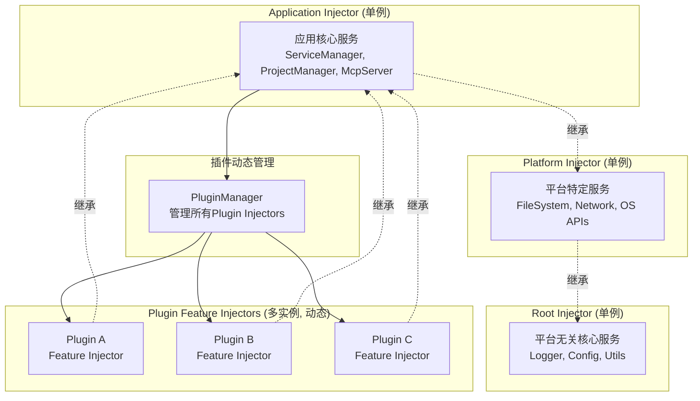
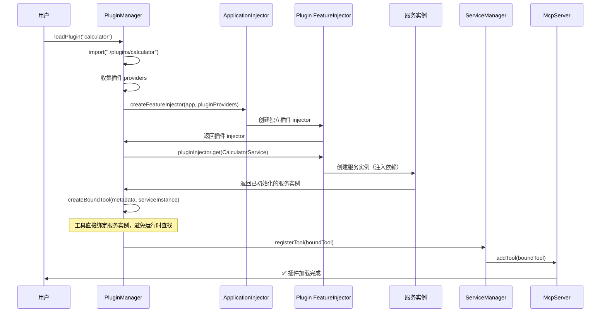
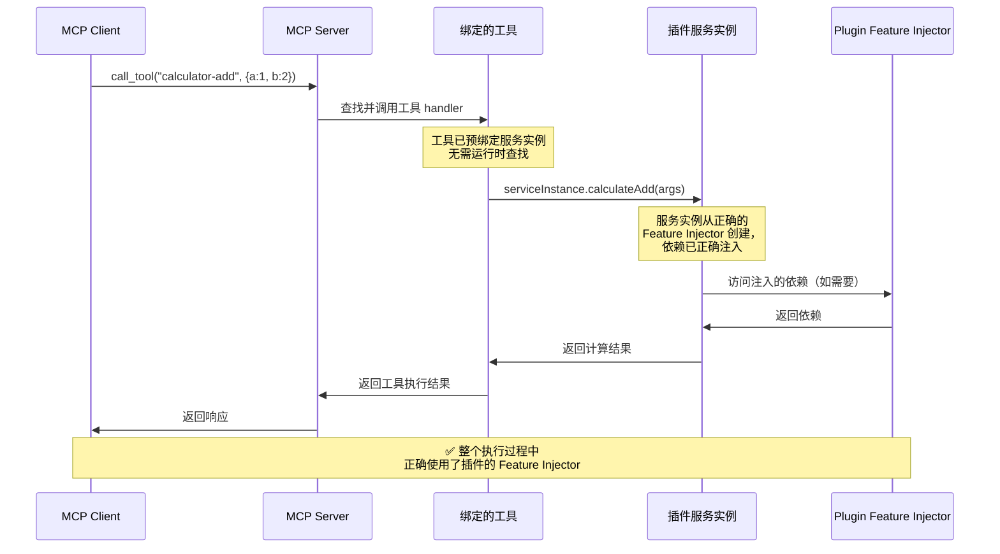
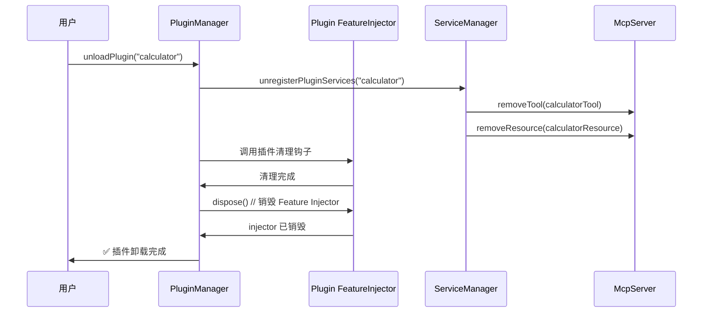
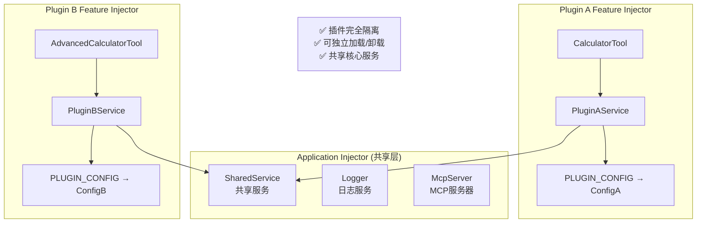

# 🔌 插件系统架构

## 概述

Sker Daemon 插件系统基于 **Feature Injector 隔离架构**设计，为每个插件创建独立的依赖注入容器，实现插件的完全隔离和动态管理。这种设计既保持了与 Injector 设计原则的兼容性，又实现了插件的动态加载/卸载能力。

## 设计原则

### Feature Injector 隔离策略

**核心设计**: 每个插件使用独立的 `createFeatureInjector`，实现插件级别的依赖隔离，支持真正的动态加载/卸载。

- **插件隔离**: 每个插件拥有独立的 Feature Injector，providers 完全隔离
- **动态管理**: 支持插件的运行时加载、卸载和重载
- **依赖继承**: 插件可以访问 Application Injector 的共享服务
- **安全清理**: 插件卸载时通过销毁 Feature Injector 完全清理相关资源

## 项目配置

### 配置接口扩展

```typescript
export interface IMcpServerConfig {
  // ... 现有配置
  
  // 新增插件相关配置
  plugins?: {
    enabled: boolean;
    directory: string;
    autoLoad: boolean;
    allowConflicts: boolean;
    conflictStrategy: 'warn' | 'error' | 'override';
  };
  
  // 项目根目录配置
  projectRoot?: string;
  workingDirectory?: string;
}
```

### 默认配置

```typescript
export const DEFAULT_PLUGIN_CONFIG = {
  enabled: true,
  directory: './plugins',
  autoLoad: true,
  allowConflicts: true,
  conflictStrategy: 'warn'
};
```

### 项目目录配置

插件系统默认使用用户主目录下的 `.sker` 文件夹：
- **默认插件目录**: `~/.sker/plugins`
- **环境变量**: `SKER_HOME_DIR` 可覆盖默认路径
- **配置示例**: `process.env.SKER_HOME_DIR || path.join(os.homedir(), '.sker')`

## 项目管理器

### ProjectManager

负责管理项目路径和目录结构：

```typescript
export class ProjectManager implements IProjectManager {
  constructor(config: IMcpServerConfig);
  
  getProjectRoot(): string;
  getPluginsDirectory(): string;
  getWorkingDirectory(): string;
  resolveRelativePath(relativePath: string): string;
  ensureDirectoryExists(path: string): Promise<void>;
}
```

## 插件定义

### 插件元数据 (package.json)

```json
{
  "name": "my-mcp-plugin",
  "version": "1.0.0", 
  "description": "我的 MCP 插件",
  "main": "index.js",
  "mcpPlugin": true,
  "author": "开发者",
  "engines": {
    "node": ">=18.0.0",
    "sker": ">=1.0.0"
  }
}
```

### 插件接口

```typescript
export interface IPlugin {
  name: string;
  version: string;
  description: string;
  services: any[];  // 服务类数组
  
  // 生命周期钩子
  onLoad?(): Promise<void>;
  onUnload?(): Promise<void>;
  onActivate?(): Promise<void>;
  onDeactivate?(): Promise<void>;
}
```

### 插件状态

```typescript
export enum PluginStatus {
  DISCOVERED = 'discovered',
  LOADING = 'loading', 
  LOADED = 'loaded',
  ACTIVE = 'active',
  ERROR = 'error',
  DISABLED = 'disabled'
}
```

## 插件发现机制

### PluginDiscovery

自动发现和验证插件：

```typescript
export class PluginDiscovery {
  async discoverPlugins(): Promise<PluginDiscoveryResult>;
  async validatePlugin(pluginPath: string): Promise<ValidationResult>;
  
  private async scanForPlugins(dir: string): Promise<string[]>;
  private async loadPluginMetadata(pluginPath: string): Promise<IPluginMetadata>;
}
```

### 发现流程

1. **递归扫描** plugins 目录及子目录
2. **识别插件** 检查 package.json 中的 `mcpPlugin: true`
3. **并行验证** 验证插件元数据和入口文件
4. **收集结果** 返回有效插件列表和错误信息

## Injector 层次结构

### Feature Injector 插件隔离架构

基于 `@sker/di` 的层次化 Injector 架构，每个插件使用独立的 `createFeatureInjector`，实现完全隔离：



### 动态插件管理

```typescript
export class PluginManager {
  private pluginInjectors = new Map<string, Injector>();
  private applicationInjector: Injector;
  
  async loadPlugin(pluginName: string): Promise<void> {
    // 1. 导入插件模块
    const plugin = await import(`./plugins/${pluginName}`);
    
    // 2. 收集插件 providers
    const providers = MetadataCollector.collectProvidersFromServices(plugin.services);
    
    // 3. 为插件创建独立的 Feature Injector
    const pluginInjector = createFeatureInjector(this.applicationInjector, providers);
    
    // 4. 存储插件 injector
    this.pluginInjectors.set(pluginName, pluginInjector);
    
    // 5. 注册插件服务（预绑定服务实例）
    await this.registerPluginServices(pluginName, pluginInjector, plugin.services);
  }
  
  async unloadPlugin(pluginName: string): Promise<void> {
    const pluginInjector = this.pluginInjectors.get(pluginName);
    if (pluginInjector) {
      await this.unregisterPluginServices(pluginName);
      pluginInjector.dispose(); // 销毁 Feature Injector
      this.pluginInjectors.delete(pluginName);
    }
  }
  
  private async registerPluginServices(
    pluginName: string, 
    pluginInjector: Injector, 
    serviceClasses: any[]
  ): Promise<void> {
    const registry = new PluginServiceRegistry(pluginName);
    
    for (const ServiceClass of serviceClasses) {
      // 从插件的 Feature Injector 创建服务实例
      const serviceInstance = pluginInjector.get(ServiceClass);
      
      // 收集服务的工具/资源/提示元数据
      const toolsMetadata = MetadataCollector.getToolsMetadata(ServiceClass);
      const resourcesMetadata = MetadataCollector.getResourcesMetadata(ServiceClass);
      const promptsMetadata = MetadataCollector.getPromptsMetadata(ServiceClass);
      
      // 创建预绑定服务实例的工具
      for (const toolMetadata of toolsMetadata) {
        const tool = this.createBoundTool(toolMetadata, serviceInstance, pluginInjector);
        await this.serviceManager.registerTool(tool);
        registry.addTool(tool);
      }
      
      // 创建预绑定服务实例的资源
      for (const resourceMetadata of resourcesMetadata) {
        const resource = this.createBoundResource(resourceMetadata, serviceInstance, pluginInjector);
        await this.serviceManager.registerResource(resource);
        registry.addResource(resource);
      }
      
      // 创建预绑定服务实例的提示
      for (const promptMetadata of promptsMetadata) {
        const prompt = this.createBoundPrompt(promptMetadata, serviceInstance, pluginInjector);
        await this.serviceManager.registerPrompt(prompt);
        registry.addPrompt(prompt);
      }
    }
    
    this.pluginServices.set(pluginName, registry);
  }
  
  private createBoundTool(metadata: any, serviceInstance: any, injector: Injector): IMcpTool {
    return {
      name: metadata.name,
      title: metadata.title,
      description: metadata.description,
      inputSchema: metadata.inputSchema,
      
      // 直接绑定服务实例，避免运行时查找
      handler: async (args: any) => {
        return await metadata.handler.call(serviceInstance, args);
      },
      
      // 保存引用以便调试和管理
      pluginInjector: injector,
      serviceInstance: serviceInstance,
      pluginMetadata: metadata
    };
  }
}
```

## 动态加载时序

### 插件运行时加载流程



### 工具执行流程（服务实例预绑定）



### 插件卸载流程



### 关键设计点

1. **插件隔离**: 每个插件拥有独立的 Feature Injector，互不影响
2. **动态管理**: 支持运行时加载、卸载和重载插件
3. **安全清理**: 插件卸载时完全清理 injector 和所有相关资源
4. **依赖继承**: 插件可以访问 Application Injector 的共享服务

## 插件生命周期管理

### 完整生命周期管理

基于 Feature Injector 隔离架构，插件支持完整的动态生命周期：

```typescript
export interface IPluginLifecycle {
  // Feature Injector 创建后
  onInjectorCreated?(injector: Injector): Promise<void>;
  
  // 服务注册到 MCP Server 前
  onBeforeRegister?(): Promise<void>;
  
  // 服务注册到 MCP Server 后
  onAfterRegister?(): Promise<void>;
  
  // 插件卸载前
  onBeforeUnload?(): Promise<void>;
  
  // Feature Injector 销毁前
  onInjectorDispose?(): Promise<void>;
}
```

### 动态插件管理器

```typescript
export class PluginManager {
  private pluginInjectors = new Map<string, Injector>();
  private applicationInjector: Injector;
  
  // 动态插件操作
  async loadPlugin(pluginName: string): Promise<void>;
  async unloadPlugin(pluginName: string): Promise<void>;
  async reloadPlugin(pluginName: string): Promise<void>;
  
  // 插件发现和验证
  async discoverPlugins(): Promise<PluginDiscoveryResult>;
  async validatePlugin(pluginPath: string): Promise<ValidationResult>;
  
  // 状态查询
  getActivePlugins(): string[];
  getPluginStatus(name: string): PluginStatus;
  getAllPluginInfo(): PluginInfo[];
}
```

### 动态加载/卸载支持

**核心能力**: 基于 Feature Injector 隔离架构，完全支持插件的运行时动态管理。

**实现原理**: 每个插件使用独立的 `createFeatureInjector`，可以独立创建和销毁。

#### 插件隔离优势



**架构详细设计**: 详见 [Feature Injector 插件隔离架构](./plugin-feature-injector-design.md)

## 实现示例

### 应用启动代码

```typescript
export class McpApplication {
  private pluginManager: PluginManager;
  
  async start(): Promise<void> {
    console.log('🚀 启动 Sker Daemon MCP 服务器...');
    
    // 1. 创建 Application Injector（只包含核心服务）
    const coreProviders = createMcpProviders(this.config);
    this.injector = createApplicationInjector(this.platformInjector, coreProviders);
    
    // 2. 初始化插件管理器
    this.pluginManager = new PluginManager(this.injector);
    
    // 3. 启动时发现并加载所有插件
    await this.loadAllPluginsAtStartup();
    
    // 4. 启动核心服务
    this.serviceManager = this.injector.get(SERVICE_MANAGER);
    await this.serviceManager.start();
    
    console.log('✅ 服务器启动完成，所有插件已加载');
    console.log('💡 MCP Client 连接时将看到完整功能列表');
  }
  
  private async loadAllPluginsAtStartup(): Promise<void> {
    console.log('📦 启动时加载所有插件...');
    
    // 发现所有可用插件
    const discoveries = await this.pluginManager.discoverPlugins();
    
    if (discoveries.validPlugins.length === 0) {
      console.log('⚠️ 未发现任何有效插件');
      return;
    }
    
    console.log(`📦 发现 ${discoveries.validPlugins.length} 个插件，开始加载...`);
    
    // 加载所有有效插件
    for (const plugin of discoveries.validPlugins) {
      try {
        console.log(`📦 加载插件: ${plugin.name}@${plugin.version}`);
        await this.pluginManager.loadPlugin(plugin.name);
        console.log(`✅ 插件加载成功: ${plugin.name}`);
      } catch (error) {
        console.error(`❌ 插件加载失败: ${plugin.name} - ${error.message}`);
        // 继续加载其他插件，不因单个插件失败而中止
      }
    }
    
    const loadedCount = this.pluginManager.getActivePlugins().length;
    console.log(`📦 插件加载完成，成功加载 ${loadedCount} 个插件`);
  }
}
```

### 动态插件管理（开发时和运维管理）

虽然启动时会加载所有插件，但动态插件管理功能仍然重要，主要用于：

```typescript
// 运行时管理 API（主要用于开发和运维）
export class PluginController {
  constructor(private pluginManager: PluginManager) {}
  
  // 安装新插件（将插件文件放入plugins目录后加载）
  async installAndLoadPlugin(pluginName: string): Promise<{ success: boolean; message: string }> {
    try {
      await this.pluginManager.loadPlugin(pluginName);
      return { success: true, message: `新插件 ${pluginName} 安装并加载成功` };
    } catch (error) {
      return { success: false, message: `插件安装失败: ${error.message}` };
    }
  }
  
  // 卸载插件（运维或调试时移除有问题的插件）
  async unloadPlugin(pluginName: string): Promise<{ success: boolean; message: string }> {
    try {
      await this.pluginManager.unloadPlugin(pluginName);
      return { success: true, message: `插件 ${pluginName} 卸载成功` };
    } catch (error) {
      return { success: false, message: `插件卸载失败: ${error.message}` };
    }
  }
  
  // 重载插件（开发时热更新，或修复插件问题后重载）
  async reloadPlugin(pluginName: string): Promise<{ success: boolean; message: string }> {
    try {
      await this.pluginManager.reloadPlugin(pluginName);
      return { success: true, message: `插件 ${pluginName} 重载成功` };
    } catch (error) {
      return { success: false, message: `插件重载失败: ${error.message}` };
    }
  }
  
  // 列出所有插件状态
  listPlugins(): PluginInfo[] {
    return this.pluginManager.getAllPluginInfo();
  }
  
  // 重新扫描并加载新添加的插件
  async rescanAndLoadNewPlugins(): Promise<{ loaded: string[]; failed: string[] }> {
    const discoveries = await this.pluginManager.discoverPlugins();
    const currentlyLoaded = new Set(this.pluginManager.getActivePlugins());
    const newPlugins = discoveries.validPlugins.filter(p => !currentlyLoaded.has(p.name));
    
    const loaded: string[] = [];
    const failed: string[] = [];
    
    for (const plugin of newPlugins) {
      try {
        await this.pluginManager.loadPlugin(plugin.name);
        loaded.push(plugin.name);
      } catch (error) {
        failed.push(plugin.name);
      }
    }
    
    return { loaded, failed };
  }
}

## 插件热更新（开发环境）

### 开发时的热重载支持

启动时加载所有插件不影响开发时的热更新能力。基于 Feature Injector 架构，完全支持插件的热重载：

```typescript
// 开发模式下的插件热重载
export class PluginHotReloader {
  private fileWatcher: chokidar.FSWatcher;
  
  constructor(private pluginManager: PluginManager) {
    if (process.env.NODE_ENV === 'development') {
      console.log('🔥 启用插件热重载（开发模式）');
      this.setupFileWatcher();
    }
  }
  
  private setupFileWatcher(): void {
    this.fileWatcher = chokidar.watch(`${pluginsDirectory}/**/*`, {
      ignored: /node_modules/,
      persistent: true
    });
    
    this.fileWatcher.on('change', async (filePath) => {
      const pluginName = this.getPluginNameFromPath(filePath);
      if (pluginName) {
        console.log(`🔄 检测到插件变更: ${pluginName}`);
        try {
          await this.pluginManager.reloadPlugin(pluginName);
          console.log(`✅ 插件热重载完成: ${pluginName}`);
        } catch (error) {
          console.error(`❌ 插件热重载失败: ${pluginName} - ${error.message}`);
        }
      }
    });
    
    // 监听新插件添加
    this.fileWatcher.on('add', async (filePath) => {
      if (filePath.endsWith('package.json')) {
        const pluginName = this.getPluginNameFromPath(filePath);
        if (pluginName && await this.isValidPlugin(filePath)) {
          console.log(`🆕 检测到新插件: ${pluginName}`);
          try {
            await this.pluginManager.loadPlugin(pluginName);
            console.log(`✅ 新插件自动加载完成: ${pluginName}`);
          } catch (error) {
            console.error(`❌ 新插件加载失败: ${pluginName} - ${error.message}`);
          }
        }
      }
    });
  }
  
  private async isValidPlugin(packageJsonPath: string): Promise<boolean> {
    try {
      const pkg = JSON.parse(await fs.readFile(packageJsonPath, 'utf8'));
      return pkg.mcpPlugin === true;
    } catch {
      return false;
    }
  }
}
```

### 热重载的优势

1. **开发体验优化**: 修改插件代码后立即生效，无需重启服务器
2. **MCP Client 无感知**: 热重载过程中 MCP 连接保持活跃，Client 端无感知
3. **Feature Injector 隔离**: 重载插件时只影响该插件，其他插件不受影响
4. **新插件自动发现**: 开发时添加新插件会自动被发现和加载

### 插件版本管理

```typescript
export class PluginVersionManager {
  // 支持多版本插件共存
  async loadPluginVersion(pluginName: string, version: string): Promise<void> {
    const pluginKey = `${pluginName}@${version}`;
    const pluginPath = `./plugins/${pluginName}/${version}`;
    
    // 为特定版本创建独立的 Feature Injector
    const plugin = await import(pluginPath);
    const providers = MetadataCollector.collectProvidersFromServices(plugin.services);
    const injector = createFeatureInjector(this.applicationInjector, providers);
    
    this.pluginInjectors.set(pluginKey, injector);
  }
  
  // 平滑升级插件版本
  async upgradePlugin(pluginName: string, fromVersion: string, toVersion: string): Promise<void> {
    // 1. 加载新版本
    await this.loadPluginVersion(pluginName, toVersion);
    
    // 2. 迁移数据（如需要）
    await this.migratePluginData(pluginName, fromVersion, toVersion);
    
    // 3. 卸载旧版本
    await this.unloadPluginVersion(pluginName, fromVersion);
  }
}
```

## 设计优势

### 1. 符合 MCP 协议预期
- ✅ **启动即可用**: MCP Client 连接时能立即看到完整的工具/资源列表
- ✅ **用户体验优秀**: 无需额外操作，所有功能开箱即用
- ✅ **协议兼容**: 完全符合 MCP 协议的设计理念

### 2. 高性能服务实例预绑定
- ✅ **执行效率最优**: 工具调用时无运行时查找开销
- ✅ **架构一致**: 确保每个工具使用正确的插件 Feature Injector
- ✅ **类型安全**: 完整的 TypeScript 类型检查和编译时验证

### 3. Feature Injector 完全隔离
- ✅ **插件独立**: 每个插件拥有独立的 Feature Injector
- ✅ **故障隔离**: 单个插件问题不影响其他插件和核心系统
- ✅ **依赖隔离**: 插件间依赖不冲突，安全独立管理
- ✅ **资源共享**: 插件可访问 Application Injector 的共享服务

### 4. 开发时动态管理
- ✅ **热重载支持**: 开发时修改插件代码立即生效
- ✅ **新插件自动发现**: 添加新插件自动检测和加载
- ✅ **运维友好**: 支持运行时卸载有问题的插件
- ✅ **调试便利**: 清晰的插件状态和错误处理

### 5. 企业级稳定性
- ✅ **启动时验证**: 所有插件在启动时验证，避免运行时意外
- ✅ **优雅降级**: 单个插件加载失败不影响整体启动
- ✅ **内存安全**: Feature Injector 销毁时完全清理相关资源
- ✅ **生产可靠**: 启动后插件集合固化，运行时状态稳定

## 相关文档

- [📦 插件开发指南](./plugin-development.md) - 详细的插件开发教程
- [🏠 核心架构](./core-architecture.md) - 系统整体架构